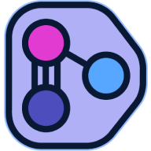

<h1 align="center">NiTROUS VSCode Color Theme</h1>

<h2 align="center">
<small>
by <a href="https://george.merloc.co" title="Visit my website">George Merlocco 👨🏻‍💻 (scar45)</a>
</small>
</h2>

---

## Description

A dark color theme for VSCode inspired by futuristic holo tech, comprised of a purple, pink, and blue palette.

## Preview

## Installation

1. Copy this source folder into the `$HOME/.vscode/extensions` folder and restart Code if it was running.
1. Click **Settings**, then choose **Color Theme** (or press the `CTRL`+`K`, `CTRL`+`T` shortcut sequence)
1. Select "NiTROUS" from the list of themes.

---

_.end_
