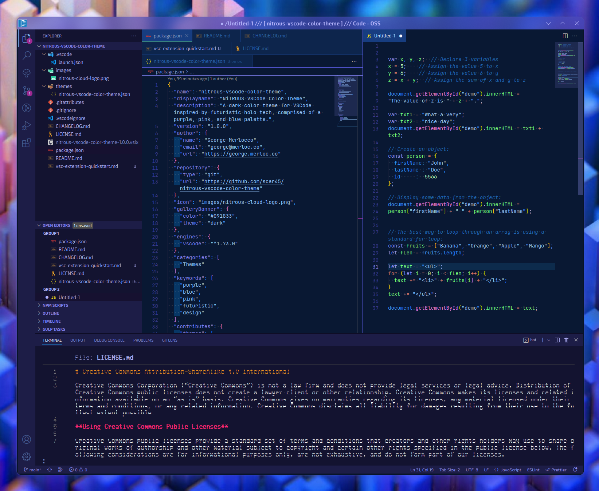

<p align="center">

</p>

<h1 align="center" style="border: 0; margin-bottom: 0">NiTROUS Theme (Dark)</h1>

<p align="center">
<em><small>designed by</small></em> <a href="https://george.merloc.co" title="Visit my website">George Merlocco 👨🏻‍💻 (scar45)</a>
<br>
<em><small>published by</small></em> <a href="https://nitrous.cloud" title="Visit nitrous.cloud">NiTROUS Cloud</a> 💨
</p>

<p align="center">
  <a href="https://marketplace.visualstudio.com/items?itemName=nitrous-cloud.nitrous-vscode-color-theme">
    
  </a>
  <a href="https://marketplace.visualstudio.com/items?itemName=nitrous-cloud.nitrous-vscode-color-theme&ssr=false#review-details">
    
  </a>
</p>

---

## Description

A dark color theme for VSCode inspired by futuristic holo tech, comprised mainly of a purple and blue palette, with pink accents.

## Preview



## Installation

1. Within VSCode (or Code-OSS/etc.), launch **Quick Open** (`Ctrl` + `P`), paste the following: `ext install nitrous-cloud.nitrous-vscode-color-theme`, then press **Enter**

#### OR

1. From within VSCode (or compatible editor), open **Extensions** (`CTRL` + `SHIFT` + `X`) on the Activity Bar, then search for **nitrous theme**, find the one by "_nitrous-cloud_" and select it
1. Click the **Set Color Theme** button

#### OR _(while Code is NOT running)_

1. Download the [latest release](https://github.com/scar45/nitrous-vscode-color-theme/releases/latest)
1. Install the extension with `code --install-extension nitrous-vscode-color-theme-{VERSION}.vsix`

## Suggested Config Edits

Select your desired settings below, and copy them into your `settings.json` config file to further complement the theme:

```
  "indentRainbow.colors": [
    "!Module",
    "#2d90ff56",
    "#e23bd144",
    "#75ff7a44",
    "#6060ee77"
  ],
  "indentRainbow.errorColor": "#ff3e3eaa",
  "editor.cursorBlinking": "phase",
  "editor.cursorStyle": "underline",
  "editor.cursorSmoothCaretAnimation": true,
  "editor.smoothScrolling": true,
  "terminal.integrated.smoothScrolling": true,

```

## Thanks!

If you'd like to support my work, please share + rate my extension in the [VS Marketplace](https://marketplace.visualstudio.com/items?itemName=nitrous-cloud.nitrous-vscode-color-theme) (or [Open VSX Registry](https://open-vsx.org/extension/nitrous-cloud/nitrous-vscode-color-theme)). You can also shoot me a bit of loot on [Ko-Fi](https://ko-fi.com/scar45) for which I'd be very appreciative of. Most of all though, I hope you enjoy using this theme, and write kick-ass code while doing so. Cheers!

---

_.end_
